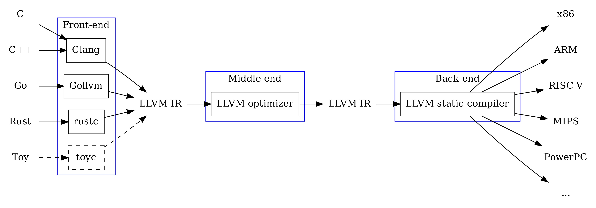

**************
A Quick Primer about LLVM
**************

这一章节会提供一些非常 basic 的 LLVM 相关的基础概念，也是学习 LLVM transformation passes 的前提。
如果有兴趣的话，还可以顺着 :doc:`llvm-installation` 和 :doc:`writing-an-llvm-pass` 学习一下怎么安装 LLVM 并写一个非常简单的 pass。
本章的知识主要来源于我之前在 CS:4980@UIowa 写的一个 Tutorial [#ref1]_，同时也感谢这个文档 [#ref2]_ 的帮助，写得太棒了。
当然，如果你已经是 LLVM 大佬的话可以直接跳过这一章了。

LLVM Compiler Infrastructure
--------
Low-Level Virtual Machine (LLVM) 是一个 compiler infrastructure，它 targets 成为一个全能的 compiler（事实上我感觉它也做到了）。
LLVM 的架构如下图所示。
简而言之，LLVM 的核心设计在于 language/platform agnostic 的 common optimizer。
传统的 compiler 每支持一种 programming language 和一个 platform 都得把整个 frontend + backend 给重写一遍。
而 common optimizer 的存在使得 LLVM 的编译过程异常灵活：支持一个新的 programming language 只需要写其对应的 frontend；支持一个新的 platform 只需要写其对应的 backend。
除此之外，common optimizer 还可以进行各种各样有趣的 program analysis 和 transformation （没错，也就是本文档专注的 pass），可以帮助用户更好的理解和优化代码。
LLVM 自从2004年被 Chris Lattner 提出之后已经迭代了20年，现在已经是一个很大的 project 了。
我们很多耳熟能详的工具都是 LLVM 的某个 subproject：比如著名的 C/C++ compiler Clang/Clang++，symbolic execution tool KLEE，等等。

.. figure:: figures/llvm-structure.png
   :alt: LLVM compiler infrastructure

   LLVM compiler infrastructure

LLVM Intermediate Representation (IR)
--------
Intermediate Representation (IR) 是 LLVM 使用在 common optimizer（以后都简称 optimizer了）层级上的一种中间表示（也就是一种特定的 programming language）。
LLVM IR 表现为 a set of instructions；虽然它不是真正意义的的 machine-level assembly code，但是其实也差不太多。
与此同时，LLVM IR 不仅保留了一些非常底层的特征（比如 branching，basic blocks），也保留了一些顶层编程语言有的特征（比如 variable name，function），从而确保了其可读性。
所以，LLVM IR 现在已经成为了很多研究领域非常 dominant 的工具，比如 program analysis，code optimization，和 soft error resilience，等等。

LLVM IR 有两种格式，分别是 human-readable ``.ll`` 和 binary code ``.bc``。
这两种格式之间是可以相互转换的，我们这里的解释主要 focus 在 ``.ll`` 上。
LLVM IR 主要有三层 components，分别是 function，basic block (BB)，和 instruction。

- **Function**: 一个程序的 LLVM IR 可能由多个 function 组成。在大多数情况下，LLVM IR 层级的 function 都是和 source code 上 function 的一一对应的。
- **Basic block (BB)**: 一个 function 由一个或者多个 basic block 组成。Basic block 同样也是记录 LLVM IR 中 branching 信息和 control-flow 关系的最小单位。
- **Instruction**: 一个 basic block 由一个或多个 instruction 组成。每个 instruction 都有自己对应的 type 和 variables。

下面给个例子来帮助认识一下 LLVM IR。下面有两段代码，分别是一个 C 程序的 source code 和其对应的 LLVM IR。

.. code-block:: C

   int variable = 21;

   int main()
   {
      variable = variable * 2;
      return variable;
   }

可以看到，这个程序的 LLVM IR 和 C code 一样都只有一个 ``main`` function；这个 function 同样只有一个 basic block；而这个 basic block 里有四个 instructions，他们的类型分别是 ``load``， ``mul``， ``store``， 和 ``ret``。

.. code-block:: llvm
   @variable = global i32 21          ; define global variable, in LLVM IR global variable starts with '@'

   define i32 @main() {
      %1 = load i32, i32* @variable   ; load the global variable, in LLVM IR local variable starts with '%'
      %2 = mul i32 %1, 2
      store i32 %2, i32* @variable    ; store instruction to write to global variable
      ret i32 %2
   }

我们再结合 LLVM compiler infrastructure 理解一下 LLVM IR 是怎么使用的。
如下图所示，给定不同的 high-level programming language，frontend 首先将其编译成 LLVM IR。
LLVM IR 经过 optimizer 的处理之后继续以 LLVM IR 的形式作为 backend 的输入，最后编译成适用于不同 platform 的 machine-level assembly code。
可以看到，在 optimizer 上，input 和 output 都是 LLVM IR，而在这个过程中进行的 program analysis/transformation 就是 **LLVM pass**。
LLVM 官方提供了很多现成的 transformation/utility/analysis pass，当然用户也可以根据自己的需求写自己的 pass（有兴趣可以读一下 :doc:`writing-an-llvm-pass`）。
LLVM pass 是一个非常强大的基于 LLVM IR 的工具。理论上只要你可以把 pass 写的足够复杂，你甚至可以把一个给定的程序完全 transform 成另一个毫不相关的程序。

   LLVM compiler infrastructure and IR

Userful LLVM Tools
--------

Others
--------
.. toctree::
   :maxdepth: 1
    llvm-installation
    writing-an-llvm-pass

References
--------
.. [#ref1] LLVM Tutorial in CS:4980@UIowa: https://hyfshishen.github.io/tutorial-01-llvm.html
.. [#ref2] Mapping High Level Constructs to LLVM IR: https://mapping-high-level-constructs-to-llvm-ir.readthedocs.io/en/latest/
