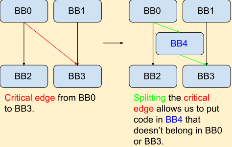

``-break-crit-edges``: Break Critical Edges in CFG
=====

在了解这个 pass 之前需要学习的背景知识是 :doc:`../compiler-basics/critical-edges-in-cfg`。

Description
--------

``-break-crit-edges`` 就是通过加入一个虚假的 basic block (i.e. dummy bb)，去把这个 critical edges 给打破。
如下图所示，本来 BB0 和 BB3 之间的 edge 是一个 critical edge，但是这里加入了一个 BB4。
这个 BB4 里面没有任何 functional instruction，就是单纯的跳转一下。
这样，每一个 BB 都只有一个 successor，且每一个 BB 都只有一个 predecessor。Critical edges就被打破了。

   Breaking a critical edge [#ref1]_

这样做的意义是什么呢？如果存在 critical edges 的话，这会造成 suboptimal 的 code generation，进而阻止其他的 compiler 的优化，从而影响性能。

在 LLVM 的 implementation 中， ``-break-crit-edges`` 还可以同时 update forward dominator（包括set, immediate dominator, tree, and frontier），从而保持 IR 功能上的正确性。

上面的图来自 reference： 
.. [#ref1] Critical Edge Splitting: https://nickdesaulniers.github.io/blog/2023/01/27/critical-edge-splitting/

Code Example
--------

原始的 IR。

.. code-block:: llvm

    define void @foo(i32 %a) {
    entry:
        %cmp = icmp eq i32 %a, 0
        br i1 %cmp, label %iftrue, label %iffalse

        other:
            ; Code for the other branch
            br label %iffalse

    iftrue:
        ; Code for the true branch
        br label ......

    iffalse:
        ; Code for the false branch
        br label ......
    }

``-break-crit-edges`` transform 之后的 IR。

.. code-block:: llvm

    define void @foo(i32 %a) {
    entry:
        %cmp = icmp eq i32 %a, 0
        br i1 %cmp, label %iftrue, label %split

    split: ; I am a dummy BB, do nothing here :)
        br label %iffalse

        other:
            ; Code for the other branch
            br label %ifflase

    iftrue:
        ; Code for the true branch
        br label ......

    iffalse:
            ; Code for the false branch
            br label ......
    }

原理很简单，其实就是加入了一个 dummy BB。
