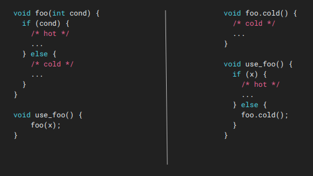

``-partial-inliner``: Partial Inliner
=====

Description
--------

``-partial-inliner`` pass 在做的事也是 inline 一个 function call 的 body，不过这里特指整个 function body 是一个 ``if-else`` statement 的那种 function。
如果这个 ``if-else`` 中 ``if`` 的部分是 hot region，而另一部分 ``else`` 很少执行，那么我就只 inline ``if`` 的地方，而把 ``else`` 的地方还是放在原来的 function 里。

Code Example
--------

LLVM 官方的 interprocedural optimization slides (`Original Link <https://llvm.org/devmtg/2020-09/slides/A_Deep_Dive_into_Interprocedural_Optimization.pdf>`_) 里提到了这个 pass，而且给了一个例子，所以这里自己直接借用了。

   Explaining partial inliner, selectively inlining hot condition into caller function.
