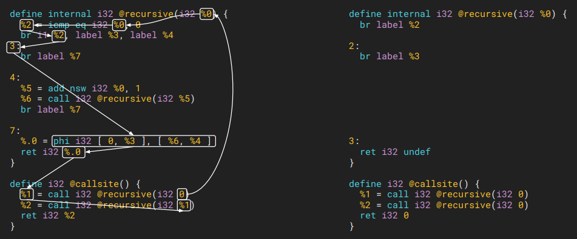

``-ipsccp``: Interprocedural Sparse Conditional Constant Propagation
=====

在了解这个 pass 之前需要学习的背景知识是 :doc:`../compiler-basics/llvm-pass-types`。

Description
--------

简而言之， ``-ipsccp`` 也就是 ``-sccp`` 的更大 code region 的 interprocedural 版本。

Code Example
--------

LLVM tutorial 有个例子很好，可以在这个 `Video Link <https://www.youtube.com/watch?v=I4Iv-HefknA>`_ 的 10:00 时刻找到，我也用这个例子了。 

   Interprocedural Sparse Conditional Constant Propagation

在这个例子中， ``@callsite()`` 第一次调用 ``@recursive(i32 0)`` function 的时候传进去了一个 ``0``；
那么通过 ``-ipsccp`` 的分析，这个 code 可以被简化成非常非常简洁的形状（如上图右侧所示）。
