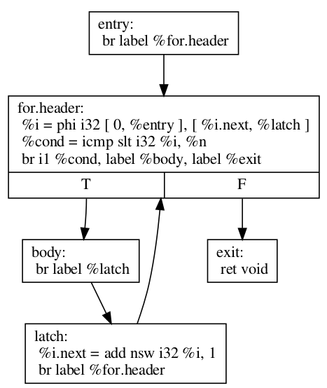
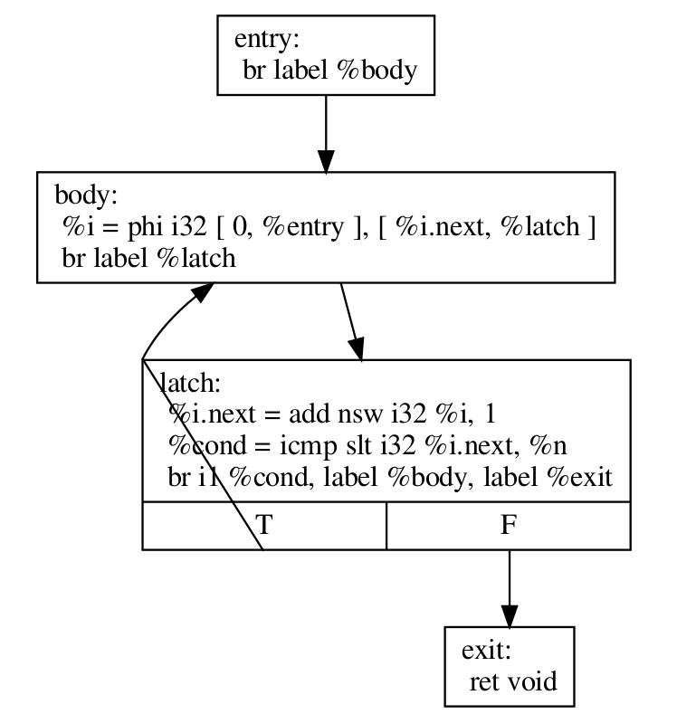

``-loop-rotate``: Rotate Loops
=====

在了解这个 pass 之前需要学习的背景知识是 :doc:`../compiler-basics/loop-terminologies-in-llvm`。

Description
--------

``-loop-rotate`` pass 把 ``for`` loop 给 transform 成 ``do-while`` loop。
当然这个 ``for`` loop 得至少运行一次才可以（这个通过添加一个 ``guard`` 来解决）。
这个猛一听没啥用啊，不就改变个形式怎么能提升 performance 呢？
其实不然，从 control-flow graph 的角度来说， ``do-while`` 确实在形式上更简洁一些 —— 它可以使用更少的 basic block 完成计算，这表明 control-flow graph 被优化了，所以 performance 也 very possibly 的高一些。
听起来有点拗口，不过看完下面的例子就明白了。

Code Example
--------

LLVM 官方文档破天荒的给了一个例子，实名感谢 `Loop Terminology <https://llvm.org/docs/LoopTerminology.html#rotated-loops>`_ 。
下面我们从 C code, IR code 和 control-flow graph 三个维度来理解一下为什么把 ``for`` loop 给 transform 成 ``do-while`` loop 有可能提升 performance。

我们先来看 C code，给定原始的 C code 如下所示：

.. code-block:: C

    void test(int n) {
    for (int i = 0; i < n; i += 1)
        // Loop body
    }

``-loop-rotate`` transform 过之后的 C code 会变成如下所示。

.. code-block:: C

    void test(int n) {
        int i = 0;
        do {
            // Loop body
            i += 1;
        } while (i < n);
    }

好像看不出来啊，这么一看的话 code 岂不是更长了么；没事，再看一下 LLVM IR 的维度。

我们将原始的 C code 给 compile 成 LLVM IR 的形式：

.. code-block:: llvm

    define void @test(i32 %n) {
    entry:
        br label %for.header

    for.header:
        %i = phi i32 [ 0, %entry ], [ %i.next, %latch ]
        %cond = icmp slt i32 %i, %n
        br i1 %cond, label %body, label %exit

    body:
        ; Loop body
        br label %latch

    latch:
        %i.next = add nsw i32 %i, 1
        br label %for.header

    exit:
        ret void
    }

``-loop-rotate`` transform 过之后的 IR code 会变成如下所示。

.. code-block:: llvm

    define void @test(i32 %n) {
    entry:
        br label %body

    body:
        %i = phi i32 [ 0, %entry ], [ %i.next, %latch ]
        ; Loop body
        br label %latch

    latch:
        %i.next = add nsw i32 %i, 1
        %cond = icmp slt i32 %i.next, %n
        br i1 %cond, label %body, label %exit

    exit:
        ret void
    }

IR code level 我们已经可以感觉到什么了，因为 ``do-while`` 版本的 loop 感觉 code 更短了。
仔细读一读，可以分析出来除了 ``entry``， ``latch``，和 ``exit`` 这种必要的 basic blocks 外， ``for.header`` 和 ``body`` 这两个 ``for`` loop中的 basic block 被 combine 成 ``do-while`` 内的一个 body basic block了。
注意， ``latch`` 的意思是计算 loop 内不同 iteration 之间 induction variable 的改变情况。

我们在把 IR code 给变成 control-flow graph，再进一步的加深一下理解。

原始 code 的 IR 表示可以被表现为如下图所示的 control-flow graph。

   Original control-flow graph.

``-loop-rotate`` 改变之后的 control-flow graph 则如下所示：

   Control-flow graph after ``-loop-rotate`` .

这个上面就可以看到的非常清晰了。这里 ``do-while`` 只需要 4 个 basic block 就可以搞定，但是 ``for`` 却需要 5 个 basic block 才能完成。这样可以把 control-flow graph 更优化，进而提升 performance。

总结一下思想，为什么 ``for`` 到 ``do-while`` loop 的逻辑能够更优化？
因为 ``do-while`` 是默认执行 loop 内的第一个 iteration（所以 body 不执行的话不能直接 exit ）；而 ``for`` 得先判定满不满足条件，才决定要不要执行 body （这就意味着 body 可以一次不执行直接 exit）。
``do-while`` 确实使用场景更 limited 一些，所以也就需要一个 guard 来判定 loop 至少执行一次；但是在我们写 code 的过程中大多数情况下 loop 都是至少之行很多次的，那么 ``for`` → ``do-while`` 的cost-benefit trade-off 就非常值得了！
虽然确实手写 do-while 能获得极致的 performance，但是这个在实操过程中最好还是先让 compiler 来做；之后再自己手写更为稳妥一些。
