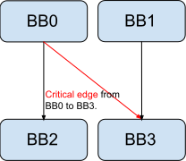

Critical Edges in CFG
=====

在 control-flow graph 中，basic block 之间互相的跳转（比如 ``br %BB1`` 指向的 ``%BB1``）form成了一个 **edge**。
起始的 basic block 叫做被跳转到的 basic block 的 **predecessor**，而这个被跳转到的另一个 basic block 叫做起始的 basic block 的 **successor**。
如下图所示，如果一个 basic block 有好几个 successor（ ``BB0`` 有两个 successor ``BB2`` 和 ``BB3``）；
且一个 basic block 有好几个 predecessor（ ``BB3`` 有两个 predecessor ``BB0``和 ``BB1``）。
此时，这个被标红的 edge 就是 **critical edge**。

   Critical edges

这里感谢一个在 Google 工作的写 LLVM 的老哥，他写的文档比 LLVM 官方写的清楚多了 [#ref1]_。

References
--------
.. [#ref1] Critical Edge Splitting: https://nickdesaulniers.github.io/blog/2023/01/27/critical-edge-splitting/