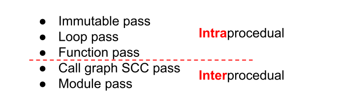

LLVM Pass Types
=====

这一块的知识来源于一个非常好的 LLVM 官方的 Tutorial Slides [#ref1]_ 和 Apple 的官方 Document [#ref2]_。
当然，这些分类归根结底都是 LLVM Pass 的 base class 的继承 [#ref0]_。

LLVM Pass Types
--------
在LLVM的pass中，一般分为如下几种：

1. **Immutable pass** 是一种很少见的什么都不改变的 transformation pass。一般以分析当前的信息为主（e.g. compiler configurations）。
2. **Loop pass** 以 function 中执行的 loop 为最小单位进行 analyze/transform。
3. **Function pass** 以 function 为最小单位进行 analyze/transform。这个过程不需要 function 在 program runtime 中调用的 order，也不会考虑 external functions。
4. **Call Graph SCC pass** 同样以 function 作为最小单位来进行，但是它考虑了所有 function 之间的 caller-callee 的调用关系，即在一个 strongly-connected-component graph 里进行 bottom-up 的 traversal。
5. **Module pass** 是最 fundamental 的 pass，也是我们在 :doc:`../LLVM-a-quick-primer/writing-an-llvm-pass` 里写的 pass。它把 program 中的每个 component 都作为 unit（function - basic block - instruction）来traversal，进而去 analyze/transform。

Intraprocedural vs Interprocedural
--------
对于上面提及的这5种 pass 来说，他们的分类如下图所示：

   LLVM pass types

上面三个是 intraprocedural 的，下面两个是 interprocedural 的。
所谓 interprocedual 也就是考虑到了程序 function 之间的互相调用和其整体结构。比如 call graph SCC pass 考虑到了 caller-callee 的关系，所以考虑了程序的整体结构，那么它就是 interprocedual 的。
而 function pass，虽然也以 function 最为最小 component，但是没有考虑它们之间的调用关系，而是当成单独的 component 访问，所以就是 intraprocedual 的了。

References
--------
.. [#ref0] LLVM Source Code, Pass.h: https://llvm.org/doxygen/Pass_8h_source.html
.. [#ref1] LLVM Optimization Slides: https://llvm.org/devmtg/2020-09/slides/A_Deep_Dive_into_Interprocedural_Optimization.pdf
.. [#ref2] Apple Writing an LLVM Pass: https://opensource.apple.com/source/clang/clang-137/src/docs/WritingAnLLVMPass.html
