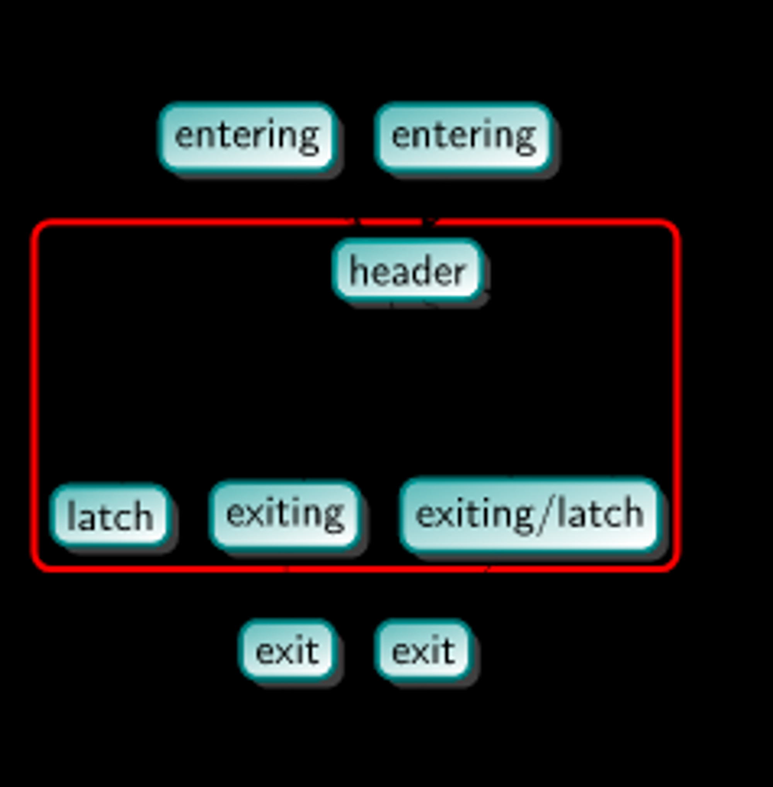

Loop Terminology in LLVM
=====

Loop 是程序中常见 component，LLVM 也在 IR 上对它有进行了详细的定义 [#ref1]_，我们这里也来了解一下。

LLVM Loop Definition
--------
在 LLVM IR 中，loop 是 program control-flow graph 中的一个subgraph，其中每个 node 都是一个 basic block。
该 subgraph 应该满足如下的格式：

- 这个 subgraph 是 strongly connected 的，即每个 node 都是 reachable 的。
- 所有进入这个 subgraph 的 edge 都会到达同一个 node，这个 node 也就是 header。换句话说，这个 header dominant 了这个 subgraph 中所有的 nodes。
- 这个 subgraph 在满足上述条件的时候必须是 maximum subset。当然不是 maximum subset 也可以是 loop，比如多个 loop 嵌套中的 inner loop，不过这里说的是比较general的定义。

比如，下图红圈内部就是一个 loop。它同时满足了条件：有一个 dominant 的 header，strongly-connected，并且 maximum subset。

   Loop example

LLVM Loop Terminology
--------
上面介绍了什么是 loop，下面详细介绍一下 loop 内 component 的标准定义（i.e. terminology）。这里还用上面的的例图。

- **Preheader** (loop predecessor)：可能有多个，也就是 entering block ，不是 loop 的一部分。
- **Header**: 所有 entering block 必须指向这个 node，即它 dominant all the other nodes in this loop。
- **Latch**：存在 backedge 的 node，也就是有 edge 指向 header 的 node。一般来说 latch 总会包含循环里 induction variable 的计算条件，比如 ``for`` loop 里的 ``i++``。
- **Exit（loop successor）**: 很好理解，exiting blocks，它同样也不是 loop 的一部分。当然从 loop 内的 node 指向 exit block 的 edge 也就是 exit edge。

你可能不知道 induction variables 是什么意思，这一块可以在这个文档中看到详细介绍 :doc:`loop-invariant-code-motion`。

LLVM Simplify Form
--------
上面我们已经理解和如何定义 loop 以及 loop 内的 component。
这里我们理解一下什么是 LLVM loop 的 simplify form，也就是 canonical form。
在 LLVM 中，Loop simplify form 指的是一个满足如下条件的 loop：

- 一个 preheader。
- 一个 latch（当然，也就只有一个 backedge）。
- Exits 被 header dominant。即，这个 loop 的 exit 没有 loop 以外的其他 node 作为 predecessor。

为什么要定义这种标准化的 loop 呢？因为 LLVM loop pass 对标准化的 loop 可以提供更高的优化效率。

References
--------
.. [#ref1] LLVM Loop Terminology: https://llvm.org/docs/LoopTerminology.html
